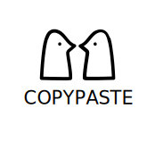

# CopyPaste
A Twine 2 Proofing Story Format that cuts it.



## Introduction
CopyPaste was created with cross-tool story development in mind and aims to facilitate extracting content from Twine 2 (including passage titles) for easy use in tools such as Obsidian and LLMs.

### News
- Version 1.1.6 released! This version comes with a new toggle button to switch between excluding ```TODO``` passages and showing only ```TODO``` passages.

### Features
- CopyPaste allows you to exclude passages from being displayed during proofing. Simply add a ```TODO``` tag to the passages you want to exclude. Use the new toggle button to invert this effect!
- The passage titles are selectable and come with ```##```, making them recognizable as titles by other tools.

## User's Guide

### Installation
1. Launch Twine 2 and navigate to the Twine tab. Click on Story Formats and then on Add.
2. Copy and paste the link to [format.js](https://cocoknight.com/CopyPaste/dist/format.js) into the Add form and click Add. CopyPaste should now appear as one of your Current Story Formats.
3. Select it and click Use to Proof Stories.

### Usage
1. Open your Story.
2. (Optional) Tag passages you want to exclude from proofing with a ```TODO``` tag.
3. While working on your story, go to the Build tab and click on Proof to use CopyPaste.
4. Your story will appear in your browser, ready to copy and paste into the tool of your choice.
5. Use the new toggle button at the top right of the page to invert the passage exclusion.

## Developer's Guide
If you want to work with the source, clone the repository and use Node to compile the data from src by executing ```node compile.js```. This will create the format.js file in dist.

Have fun!
